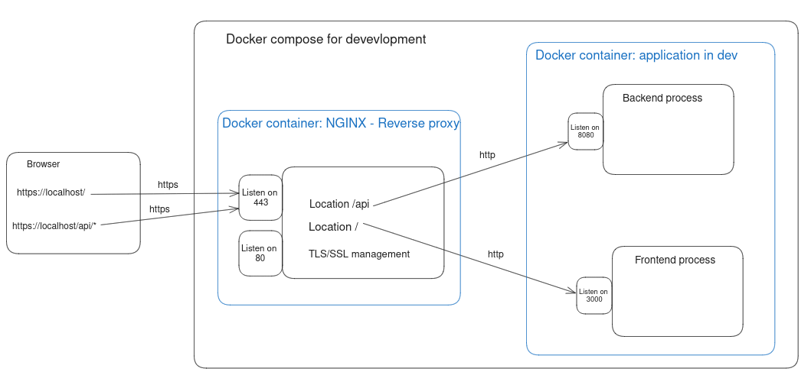

# Official Fullstack Skeleton


This project provides a production-ready fullstack web application setup. It 
includes infrastructure for containerization (via Docker), reverse proxy 
(using Nginx), and core features like user authentication, authorization, 
and automatic API documentation. An automated testing system is also implemented 
for unit tests, end-to-end tests (E2E), and performance tests.

By using Docker, the project manages development, testing, and production 
environments, minimizing dependencies on your host machine. 
Simply install Docker, and you're ready to go.


**Fullstack Skeleton overview**
- **Infrastructure:** Nginx, Docker, TLS-SSL for local development environment
- **Architecture:** Layered architecture for backend
- **Programming paradigms:** OOP for backend, Functional Programming for frontend using React
- **Automation Test (TODO: nyi):** Unit Test, End-to-End test (E2E), Performance Test
- **Programming Language:** Typescript, Bash Script
- **Backend:** Express (server framework), Tsoa-Swagger(controller & auto API docs), Postgresql (relational database), Prisma (ORM) 
- **Frontend:** React
## Table of Contents
- [Project structure](#project-structure)
- [How to run](#how-to-run)
- [Configuration](#configuration)
- [Architecture](#architecture-)
- [TODO](#todo)


## Project structure
This boilerplate use **pnpm**, a package manager to set up a workspace 
multi-package.
- **packages/**  
  Sub-packages for different project aspects (backend, frontend, etc.).

- **infrastructure/**  
  Contain entrypoint for running application and the files for infrastructure set up: Container (Docker), 
Reverse Proxy (Nginx), local TLS-SSL certificates.

- **static/**  
  Images for Docs.

- **.dockerignore**  
  Specifies files ignored by Docker; handles HTTPS via Nginx.

- **.gitignore**  
  Lists files not tracked by Git.

- **README.md**  
  Project overview, setup instructions, and docs.

- **package.json**  
  Defines global project dependencies and scripts (using `pnpm`). Each package inside
the folder `packages/` has also its own package.json

- **pnpm-lock.yaml**  
  Lock file ensuring consistent dependency versions.

- **pnpm-workspace.yaml**  
  Workspace settings for managing monorepo with `pnpm`.
In addition

## How to run
From root project, `./scripts/run.sh` is the entry point 
command to run different environments: development, production, test, 
reset environment, etc.
#### Manual
To see all options of the command `./scripts/run.sh` run:
``` bash
./scripts/run.sh --help
```
#### Check prerequisite installed
To check whether your environment has the prerequisite to run the boilerplate. Run
``` bash
./scripts/run.sh prerequisite
```
#### Development
In development mode: 
- Frontend is served by Vite server with hot module reload
- Typescript files will not be pre-transpiled to javascript but be transpiled
in run-time by ts-node
- Mock data seed for development
- Fake email smtp server

To run development mode
``` bash
./scripts/run.sh dev
```
#### Production
In production mode:
- Frontend is built to single javascript file and served by Nginx
- Backend is transpiled from Typescript to Javascript to be run
- The mock data will not be seed

To run application in production mode
``` bash
./scripts/run.sh prod
```
#### Reset
To reset application environment.
``` bash
./scripts/run.sh reset
```  
Best practice: Always run ```./scripts/run.sh reset``` before running ```./scripts/run.sh dev``` and ```./scripts/run.sh prod``` to avoid weird errors.

#### Install package
Best practice: Run `./scripts/run.sh reset` before running any commands
bellow


To install every dependencies listed in packages/*/package.json
``` bash
pnpm install
```  
To install dev-dependency for specific package
``` bash
pnpm --filter <backend | frontend | shared | models> add --save-dev <package>
```  

To install dependency for specific package
``` bash
pnpm --filter <backend | frontend | shared | models> add <package>
```  

## Configuration
To change the name of docker containers, go to scripts/run.sh and changes the values of these variables:
``` bash
#!/bin/bash

# Define the container name for dev local
export APP_DEV_CONTAINER="app-dev"
export NGINX_REVERSE_PROXY_DEV_CONTAINER="nginx-reverse-proxy-dev"

# Define the container name for production
export BACKEND_PROD_CONTAINER="backend-prod" 
export NGINX_REVERSE_PROXY_PROD_CONTAINER="nginx-reverse-proxy-prod"
...
```

## Architecture  
#### Development  


#### Production    


## TODO
- [ ] Section explaining diff from Dev, Prod, Test environment. How they are set up.
- [ ] Restrict import from some package  
- [ ] Script to check the prerequisite or install them maybe ?
- [ ] Synchronize router, controller, API docs
- [ ] User authentication, MFA
- [ ] End-to-End test, Security test, Performance test.

